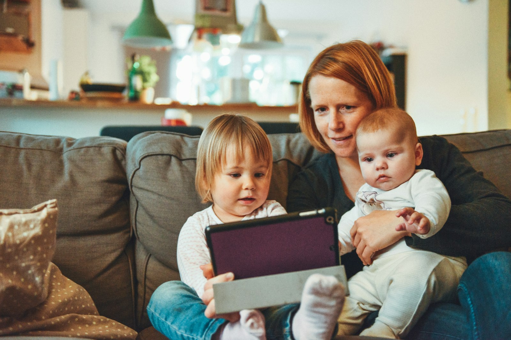

# Age-appropriate screen time, now that the "two-hour rule" is gone

*Meta description: For a decade, "under two hours a day" was the go-to screen time number. The American Academy of Pediatrics just retired it. Here's what replaced it, by age.*

~2 min read

Photo by [Alexander Dummer](https://unsplash.com/@4dgraphic) on [Unsplash](https://unsplash.com/photos/UH-xs-FizTk)

If you've ever tried to figure out "how much screen time is okay for a 9-year-old" by searching it, you've probably landed on the same number for years: two hours a day, from the American Academy of Pediatrics' 2016 guidance. That number is no longer the AAP's guidance. In January 2026, the AAP published a new policy statement and technical report, "Digital Ecosystems, Children, and Adolescents," in the February 2026 issue of *Pediatrics* — its first major update to screen time guidance in a decade, and it deliberately drops the fixed-hour number. (American Academy of Pediatrics, *Pediatrics*, Vol. 157, Issue 2, published January 20, 2026)

## Why the AAP moved off a fixed number

A single daily limit treats an hour of a video call with grandparents the same as an hour of autoplay algorithmic video, which was always the weak point of the old guidance. The new policy statement reframes the question around what the AAP calls the "digital ecosystem" — the content, the design of the app or platform, and the context the child is in — rather than a stopwatch. That's a real shift in emphasis, not just softer language: the same number of minutes can be fine or genuinely harmful depending on what fills them.

## What actually varies by age

The new guidance still treats age as the starting point, it just doesn't attach a single number to it:

- **Under 18 months**: avoid screen media beyond video-chatting with family — this part hasn't changed from 2016.
- **18 months–5 years**: co-viewed, high-quality educational content, kept limited, with an adult actually watching alongside the child rather than the tablet functioning as a babysitter.
- **6–12 years**: no default limit — instead, a family media plan that both the parent and the child actually agree on, revisited as the child's judgment develops.
- **Teens**: less about hours and more about protecting sleep, in-person time, and physical activity from being displaced, with the teen increasingly setting their own guardrails.

## The part that's easy to miss

A family media plan sounds like paperwork, but the actual ask is narrower: agree on device-free times (meals, the hour before bed) and device-free spaces (bedrooms overnight), and revisit the agreement as your kid gets older instead of setting it once and forgetting it. The AAP's own framing puts weight on *how* the limit gets set — with the child, not just handed down — as much as what the limit is.

## Where Paxio fits, and where it doesn't

A daily-limit number is still a reasonable tool for a lot of families — the AAP retiring "two hours" as a universal default doesn't mean every family needs a bespoke media plan from scratch, and Paxio's screen-time limits and bedtime windows work fine as the practical version of "device-free times and spaces." What Paxio can't do is judge content quality or co-view with your kid — that part of the new guidance is still a parent's call, not a setting.

[Paxio](../index.html) handles the screen-time and bedtime side: limits, bedtime windows, and app blocking, free for one child. The conversation about what's actually on the screen during that time is worth having separately.

<a class="btn btn-primary" href="../index.html#download">Try Paxio free →</a>

