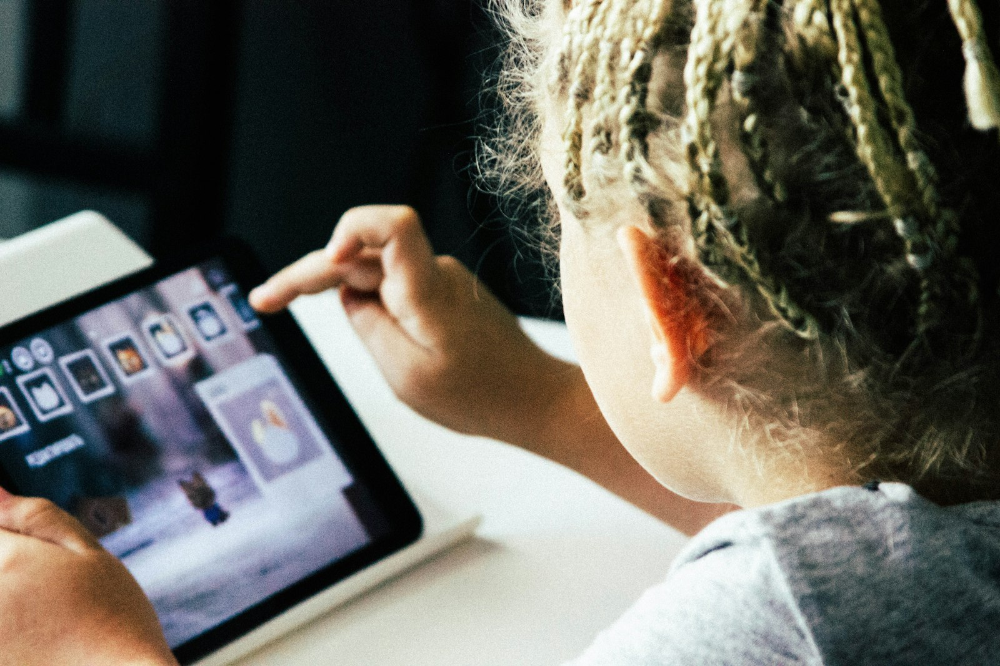

# Finishing the app isn't the same as learning from it

_Meta description: A new APA report says clicking, collecting rewards, and finishing a learning app aren't proof a kid actually learned anything. Here's what to check instead._

_~2-3 min read_

Photo by <a href="https://unsplash.com/@igorstarkoff">Igor Starkov</a> on <a href="https://unsplash.com/photos/s4GL0XwPSIU">Unsplash</a>

"Educational" is one of the most trusted words on an app store listing — right up there with "ad-free" — and it's doing less work than it looks like. On September 3, 2026, the American Psychological Association published a report built specifically to test that word, and its central finding is blunt: a kid clicking through animations, collecting in-app rewards, and finishing a learning app is not evidence they learned anything. ([APA, "Children's and Adolescents' Learning with Educational Technology," Sept 3, 2026](https://www.apa.org/pubs/reports/children-adolescent-learning-educational-technology))

## What the report actually measured

The report covers kids and teens ages 5-18 and looks specifically at educational apps, games, tutoring software, and generative AI tools — not screens in general. Its core distinction is between *engagement* and *learning*: time spent, enjoyment, participation, and completion rates are the numbers an app can show you, but none of them are the same as whether a kid can actually use what the app was supposed to teach once the screen is off. As APA's Nicole Barnes put it, "all we're really saying is, if you're going to claim learning, you should prove it."

## Why that's harder to notice than it sounds

An app that's genuinely working and an app that's just good at holding attention can look identical from across the room — both involve a kid staring at a screen, tapping, seemingly absorbed. The report's uncomfortable point is that gamification (badges, streaks, unlockable characters) is often optimized for the same thing a game is optimized for: getting picked back up tomorrow, not building a skill that survives past the app. Neither the child nor the parent watching over their shoulder can tell the difference just by looking.

## What to actually check

The report's recommendations translate into a few concrete habits:

- **Close the app and ask.** After a session, have your kid explain the concept or solve a similar problem without the app open. If they can't, the app was probably being engaging, not teaching.
- **Watch what the time is actually going to.** If more of the session goes to picking an avatar's outfit or watching a reward animation than to the actual material, that's a real signal, not a minor complaint.
- **Be skeptical of "educational" as a label alone.** The report specifically warns against trusting vendor-commissioned studies or marketing claims that outrun independent evidence — ask what a tool's own evaluation actually measured, not just what the app store category says.

## Where Paxio fits, and where it doesn't

Paxio can't tell you whether a specific app is actually teaching your kid anything — that's a judgment about the app's content and design, not something a device-level tool can evaluate.

What [Paxio](https://www.paxio.in/)'s [usage reports](../product/kids-reports-screen.html) can do is show you which apps are actually getting the time — so when you're deciding whether that "educational" app deserves the hour it's getting, you're working from what's really happening on the device, not what the app store listing promised.
