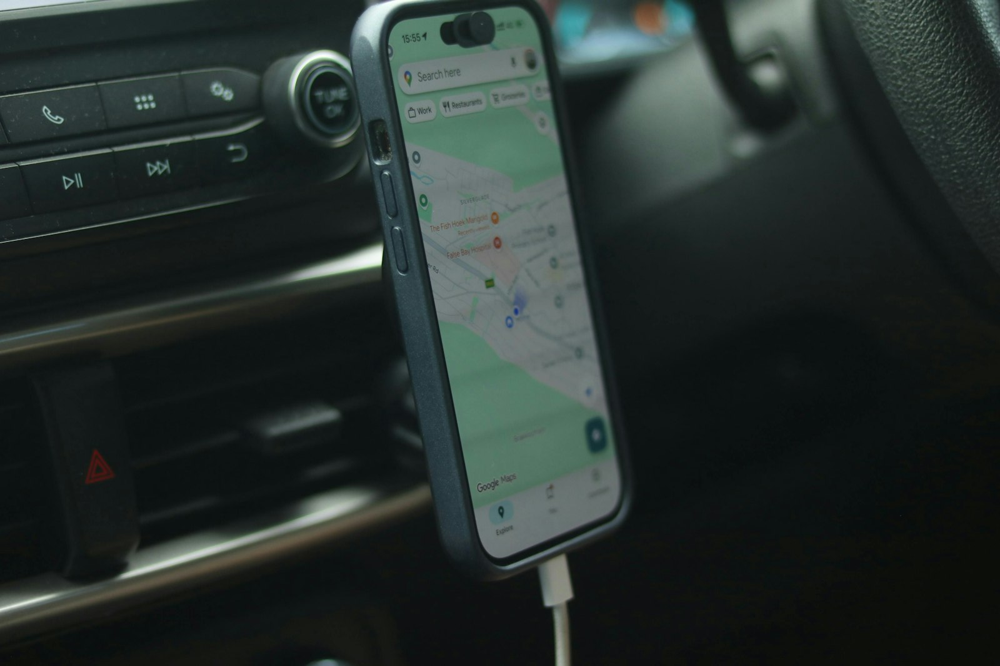
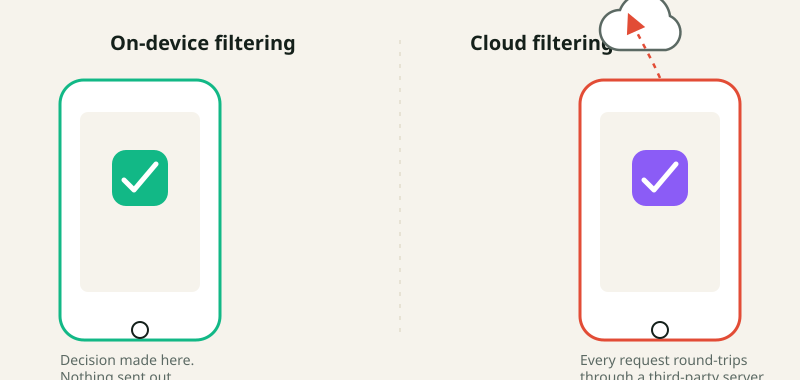

# Parental control apps that don't track your kid's location — what to look for

_Meta description: Most parental control apps quietly turn into location trackers. Here's what to actually check before you install one, and why Paxio was built to skip location tracking entirely._

Most parental control apps you'll find in the Play Store lead with the same pitch: screen time limits, app blocking, maybe a "see what they're doing" dashboard. Then, a few screens into setup, they ask for background location access. Not because a 9-year-old's phone location is the point — it's because it's easy to build, easy to demo, and easy to sell as a feature.

If you're a parent trying to manage screen time and content, not run a tracking operation, it's worth pausing on that. Here's what to actually look at before you install anything.

Photo by <a href="https://unsplash.com/@aliciachristin">Alicia Christin Gerald</a> on <a href="https://unsplash.com/photos/xdEeISgxyBI">Unsplash</a>

## The permission tells you more than the marketing page does

App store descriptions are written to sound reassuring. Permissions are not. Before installing any parental control app, check what it actually asks for on setup:

- **Background location** ("Allow all the time") is the one to watch for. If an app requests this and location tracking isn't the headline feature you're looking for, ask why it needs it.
- **Accessibility Service** access is legitimate for app blocking (it's how the app sees what's running in the foreground) — but it's also broad enough to read on-screen content if the app chooses to. Legitimate use is narrow and specific; check whether the app's privacy policy actually says what it does with that access.
- **Microphone or camera** access has no reasonable place in a screen-time or content-filtering app. If you see it requested, that's a hard stop.

A permission by itself isn't proof of misuse — but it's the one part of the install flow that isn't marketing copy, so it's the part worth actually reading.

## Why "just in case" location tracking is a bigger deal than it sounds

The pitch for location tracking is usually framed as safety: "know where they are." In practice, it means a company you've never met is continuously storing your child's real-world movements on a server somewhere, indefinitely, tied to their device. That data doesn't need to leak in a dramatic hack to be a problem — it's a standing liability the moment it's collected, regardless of how good the company's intentions are today.

There's also a quieter cost: location tracking changes the relationship. Screen time limits and content filtering are about managing a device. Location tracking is about surveilling a person. Kids notice the difference, even if they can't articulate it, and it tends to erode the trust that makes any parental control tool actually work long-term instead of just becoming something to circumvent.

## What to look for instead

If the actual goal is screen time and content — not location — look for:

1. **A privacy policy that states plainly what is and isn't collected**, not just what the app "may" do. Vague language ("may collect data to improve your experience") is a yellow flag.
2. **On-device enforcement where possible.** Content filtering that resolves DNS locally on the device, rather than routing every request through a third-party cloud server, means less of your family's browsing history ever leaves the phone in the first place.
3. **A data deletion path that's actually self-service** — in the app, not a support ticket you have to wait on.

## Where Paxio fits

We built Paxio specifically without location tracking — not as a limitation, but as a starting decision. It handles screen time limits, app blocking, bedtime scheduling, and content filtering (resolved on-device, not through a cloud filtering service), and that's the scope. No location history, no geofencing, no "see them on a map" feature waiting to be added later.

That's not because location features aren't technically easy to build — it's because the moment you're managing a device instead of tracking a person, the tool stays honest about what it's for. If that's the kind of tool you're looking for, [Paxio is free to try](https://www.paxio.in/).
