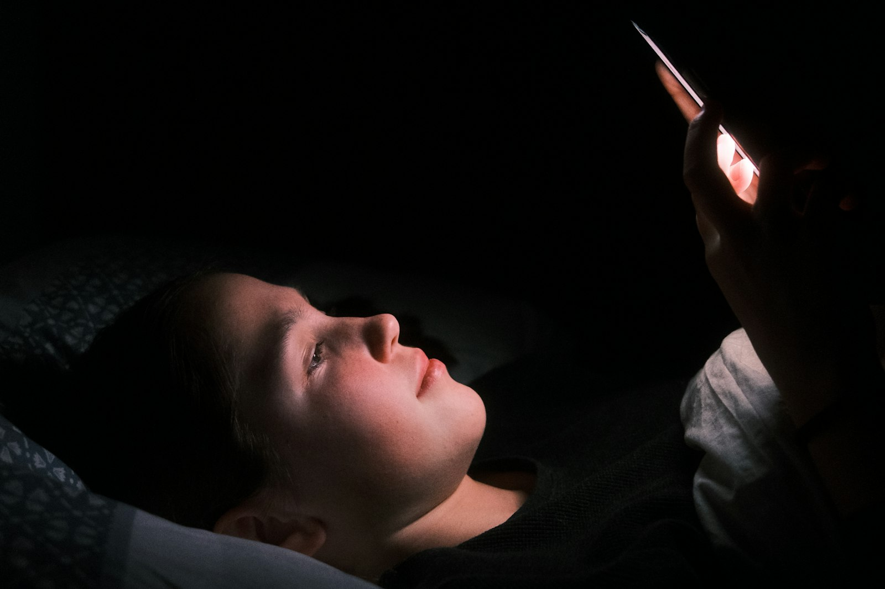

# Phones in the bedroom vs. a daily time limit: which one actually protects sleep

_SEO title (53 chars): Should Kids Keep Their Phone in the Bedroom at Night?_
_Meta description (152 chars): Should kids keep phones in the bedroom at night? What 2026 sleep research found, why a daily time limit misses it, and how to move the phone out calmly._
_Primary keyword: phone in bedroom at night (no overlap in `marketing/seo-keyword-plan.html`; only passing mentions in two existing posts)_
_Section: Screen Time_

_~5 min read_

Photo by <a href="https://unsplash.com/@kajtek">Kajetan Sumila</a> on <a href="https://unsplash.com/photos/a-woman-laying-in-bed-with-a-light-on-her-face-ygB6yVjb7a4">Unsplash</a>

A lot of families set a daily screen time limit, see it working during the day, and assume the phone question is handled. Then the phone goes to bed with the kid. A daily limit counts minutes. It doesn't ask what time those minutes happen, or whether the phone is on the pillow at 1 a.m. For sleep, that second question turns out to matter more.

## What happens to a phone in a teen's bedroom after lights out?

Most research on this has relied on teens reporting their own phone use, which is hard to do accurately about the middle of the night. A study presented at the SLEEP 2026 meeting in June did it differently. Researchers at Stony Brook University had 230 US teens install an app that passively recorded their actual phone use for about 17 days.
Their late-night use, counted as after midnight on school nights and after 1 a.m. on other nights, averaged 46 minutes a night. It also followed a pattern: on evenings when a teen used their phone about 20 minutes more than usual before bed, they used it another 8–9 minutes late at night. The lead author's takeaway was that limiting phone use before bed may cut down on late-night use and help teens sleep. ([SLEEP 2026 meeting release, June 2026](https://www.sleepmeeting.org/bedtime-smartphone-use-linked-to-overnight-phone-activity-in-teens/))
One caveat: this is a conference abstract, not a full peer-reviewed paper yet, and it shows a pattern rather than proving cause. But it matches what many parents already suspect. "Just five more minutes" in bed rarely stays five minutes.

## Why a daily time limit doesn't solve the bedroom problem

A daily limit is good at one job: capping the total. If your kid has two hours a day and uses 90 minutes after school, they still have 30 minutes left at 11 p.m., and nothing about the limit says those minutes can't be spent in bed. A limit that has already run out does stop late-night use, but that depends on how the day went, not on a rule about night.
The bedroom adds problems a limit can't touch. A phone on the nightstand can still buzz, light up and wake a kid who wasn't using it. And the easiest time to break a rule is when nobody else is awake.

## Where the phone sleeps vs. how long it's used: which matters more?

They do different jobs, so it isn't really either/or. For daytime balance, the total matters. For sleep, when and where matter more. Sleep guidance points the same way: the American Academy of Sleep Medicine suggests turning devices off 30–60 minutes before bed, and the American Academy of Pediatrics' 2026 guidance talks about device-free spaces like bedrooms overnight rather than a single daily number (we covered that shift in [our screen-time-by-age post](../../blog/age-appropriate-screen-time-milestones.html)).
If you only change one thing about night-time phone use, changing where the phone spends the night usually does more than tightening the daily total.

## How to move the phone out of the bedroom without a nightly fight

1. **Pick one charging spot outside the bedrooms, for everyone.** A rule that parents follow too feels like a household habit, not a punishment.
2. **Hand the phone over at a fixed time,** ideally 30–60 minutes before lights out, so the wind-down happens without it.
3. **Replace what the phone was doing.** A cheap alarm clock, a speaker for sleep sounds, or a book covers most of the "but I need it for…" reasons.
4. **Negotiate the edges with older kids.** A later handoff on weekends, or for a teen who has kept to the routine, makes the rule easier to live with.

## What if the phone has to stay in the room?

Sometimes it does: a shared room with nowhere else to charge it, a kid who relies on it as an alarm, or a teen who is anxious about being unreachable. In that case the goal shifts from where the phone is to what it can do overnight. Face-down and out of arm's reach helps. Do Not Disturb removes the buzzing. A scheduled lock that makes the phone quiet at bedtime removes the temptation, which is the part willpower struggles with most at midnight.

## Can Paxio keep a phone out of the bedroom?

No. No app can control where a phone physically spends the night, and the charging-spot habit above is still the strongest option. What Paxio can do is cover the nights when the phone stays in the room. Its [Bedtime Schedule](../../product/kids-bedtime-schedule.html) (a Paxio Pro feature) makes everything but calls go quiet at the sleep time you set, whether or not the daily limit has been used up. Its daily [screen time limit](../../product/kids-screen-time-limit.html) handles the daytime total.

Paxio's bedtime lock is there for the nights when the phone doesn't make it to the charging spot, so the rule about night doesn't depend on willpower at midnight.

## Frequently asked questions

### Should kids have their phone in their bedroom at night?

Sleep guidance generally says no. The American Academy of Sleep Medicine suggests turning devices off 30-60 minutes before bed, and a phone in the bedroom makes late-night use and overnight notifications much more likely.

### Is a daily screen time limit enough to protect sleep?

Not on its own. A daily limit caps the total but not the timing, so a child with minutes left at bedtime can still use them in bed. A fixed handoff time or a bedtime lock covers the night.

### What if my child needs their phone as an alarm?

A basic alarm clock usually solves it. If the phone must stay in the room, keep it out of reach with Do Not Disturb on, or use a bedtime lock that silences everything except calls overnight.
