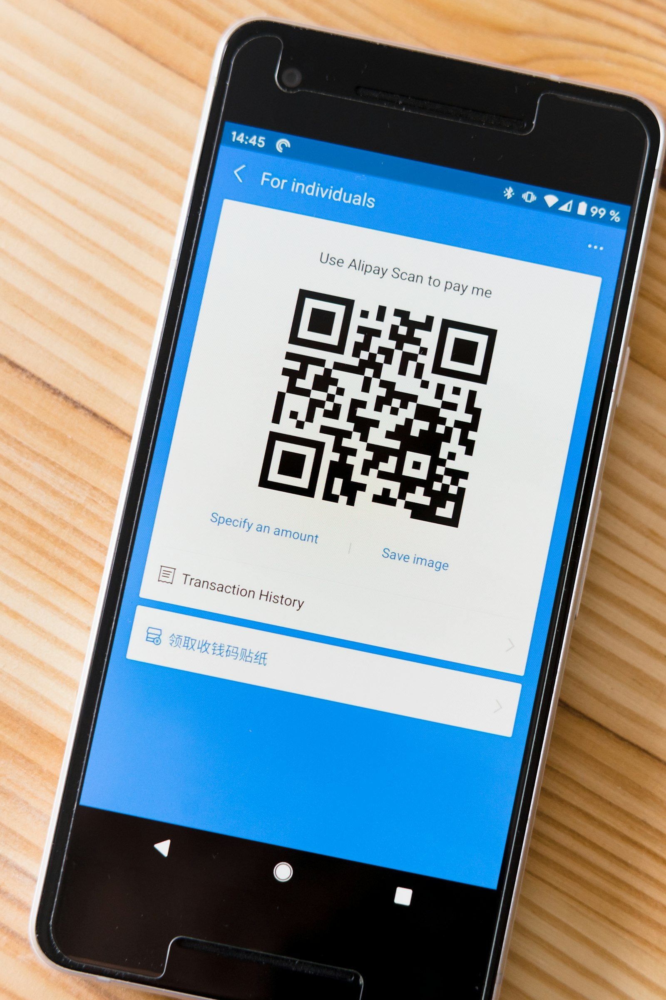

# QR code scams work because of how phones handle them — not because kids are careless

_Meta description: A QR code skips the part where you'd normally see the actual web address before clicking. That's not a kid-carelessness problem — it's how phone cameras handle QR codes by design. Here's what the FBI is warning about and what actually helps._

_~2 min read_

Photo by <a href="https://unsplash.com/@markuswinkler">Markus Winkler</a> on <a href="https://unsplash.com/photos/AmaUFhjnEBE">Unsplash</a>

A text link at least shows you something — a string of characters you can glance at and think "that doesn't look like Amazon." A QR code shows you nothing. Point a phone camera at it and the destination opens with a single tap, no address bar to check first. That's not a design flaw kids are especially bad at noticing — adults miss it too — it's just how the format works, and it's a genuinely mobile-specific problem: QR codes are built for a phone camera to scan on the spot, not something you'd run into the same way on a laptop.

## What the FBI is actually warning about

In July 2025, the FBI's Internet Crime Complaint Center warned about a specific version of this: criminals mailing unsolicited packages — no return address, nothing ordered — with a QR code on the label. Scanning it asks for payment information or quietly installs malware. The FBI's own language is worth noting: this scheme isn't yet as widespread as other fraud, but it's real enough for a formal advisory, and it previews the same trick showing up anywhere a code can be printed — parking meters, flyers, even taped over a legitimate one. ([FBI IC3, "Unsolicited Packages Containing QR Codes Used to Initiate Fraud Schemes," July 31, 2025](https://www.ic3.gov/PSA/2025/PSA250731))

## Why this lands differently on a kid's phone

A kid scanning a code someone handed them, or one in a group chat, doesn't have years of "does this link look right" instinct that catches a lot of desktop phishing — and because the code hides its destination until after the tap, that instinct wouldn't fully help anyway. The habit that transfers instead: treat an unfamiliar QR code like an unfamiliar link from a stranger, suspicious by default.

## What actually helps

- **Most phone cameras show a link preview before opening it** — a small pop-up with the destination appears for a second before the browser launches. Reading it, instead of tapping through automatically, is the actual safety check.
- **Be specifically wary of QR codes on unsolicited mail or packages** — this is the exact scheme the FBI flagged; "I didn't order this" is a stronger signal than anything about how the code itself looks.
- **A code stuck over another one is a real tactic** — on parking meters and posted flyers, scammers sometimes paste a fake code directly on top of a legitimate one. A code that looks like a sticker rather than printed material is worth a second look.
- **Treat it like any other unverified link** — same rule as a text from an unknown number: verify through a source you already trust before entering anything.

## Where Paxio fits, and where it doesn't

Content filtering blocks known-malicious domains at the DNS level, which covers a QR code that resolves to a site already flagged as bad. It can't do anything about a code that just asks someone to type personal information into a legitimate-looking form — there's no bad domain to block there. The "read the preview before tapping" habit above is the part no device setting replaces.

[Paxio](https://www.paxio.in/) handles content filtering, app blocking, screen time, and bedtime, so the DNS-level protection above runs in the background while you build the rest of the habit with your kid.
