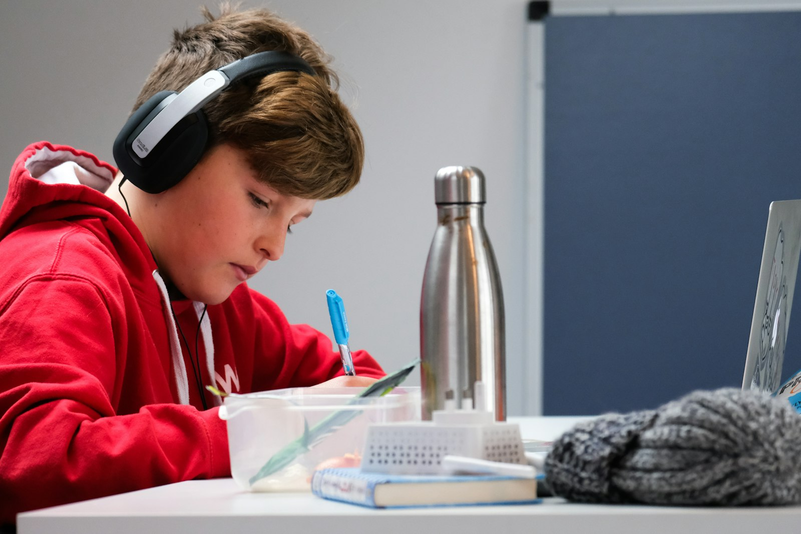

# More screen time, better thinking? What an 8-year study actually found

_Meta description: A new Finnish study tracked kids for eight years and found more screen time, not less, was linked to better cognitive performance as teenagers. Here's what that actually means — and doesn't._

_~2-3 min read_

Photo by <a href="https://unsplash.com/@comparefibre">Compare Fibre</a> on <a href="https://unsplash.com/photos/woman-in-red-and-white-hoodie-wearing-black-headphones-e5sTz361Jzg">Unsplash</a>

The default assumption going into most screen-time conversations is that more is simply worse — worse focus, worse mood, worse everything, in a straight line. A study published this August makes that line a lot less straight.

## What the study actually found

Researchers at the Universities of Jyväskylä and Eastern Finland followed 260 kids (124 girls, 136 boys) for eight years, from childhood into adolescence, as part of the long-running PANIC study. At the end of it, the kids who'd racked up *more* cumulative screen time since childhood tended to show *better* cognitive processing at age 15 to 16, not worse. ([University of Jyväskylä, August 11, 2026](https://www.jyu.fi/en/news/more-screen-time-since-childhood-associated-with-better-cognitive-processing-in-adolescence))

That's the opposite of what a lot of parents — and a lot of headlines — would expect.

## Why that's not the permission slip it sounds like

The researchers themselves are careful not to oversell this. It's an association, not a causal claim — "we need more intervention studies to find out causal relations," as they put it. And they point to the real explanation themselves: "the essential point here is what kind of things they do in their screen time." A kid using a screen to build something, learn something, or work through a problem is doing something fundamentally different from a kid scrolling — even if a stopwatch can't tell the difference.

That distinction is easy to state and hard to act on, because duration is the thing you can actually see and measure, while what's happening on the screen usually isn't visible at a glance.

## The question worth asking instead of "how long"

If total hours is a weak signal on its own, the more useful parent-level question becomes: *what is this actually replacing, and what is my kid doing with it?* A screen that's displacing sleep or in-person time is doing something different from one that's filling downtime with an interest they're actually engaged in. Same hour count, different kid, different outcome — which is exactly why a single universal time limit was always going to be a blunt instrument.

## Where Paxio fits, and where it doesn't

Paxio's screen time limits and reports tell you the number — how long, which apps, when. They can't tell you whether that hour was a kid actively building something in Minecraft or passively watching someone else do it, and no app honestly can; that distinction still requires a conversation, not a dashboard. What the limit *can* do is put a ceiling on the hours you're less sure about, so the harder question — what's actually happening during the time that's left — is the one you get to spend your attention on.

[Screen time limits](https://www.paxio.in/product/kids-screen-time-limit.html) and the [reports screen](https://www.paxio.in/product/kids-reports-screen.html) handle the counting in the background, so the conversation about *what* your kid is doing with their screen time doesn't get lost in arguing about *how much*.
