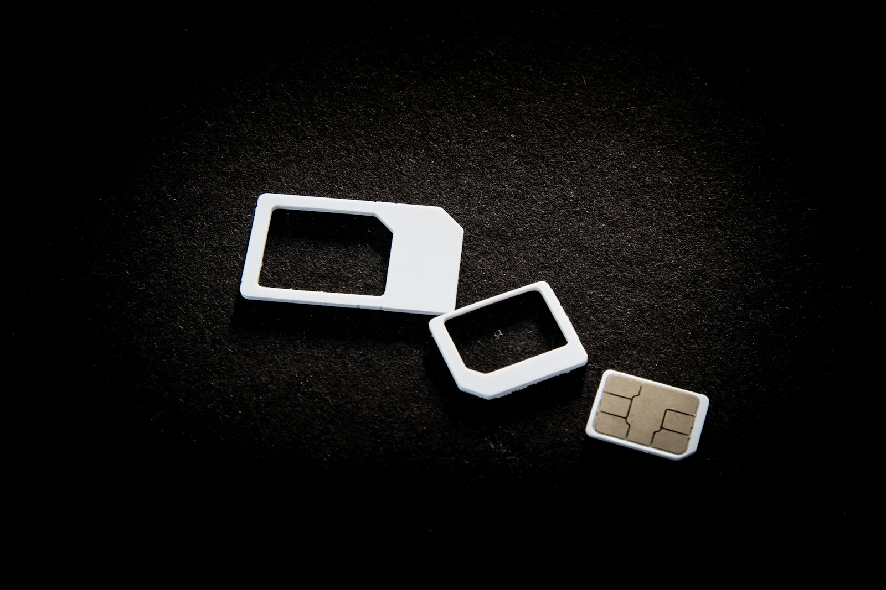

# SIM swap attacks: how a stolen phone number can take over your kid's accounts

_SEO title (58 chars): SIM Swap Scams: How a Stolen Number Hijacks Kids' Accounts_
_Meta description (152 chars): SIM swap scams move your kid's number to an attacker's SIM, then reset their accounts by text. How it works, and the carrier lock only a parent can set._
_Primary keyword: sim swap scam (no overlap in `marketing/seo-keyword-plan.html`)_
_Section: Mobile Security_

_~5 min read_

Photo by <a href="https://unsplash.com/@user_pascal">User_Pascal</a> on <a href="https://unsplash.com/photos/sim-cards-and-their-adaptors-are-on-display-7qlXFeFNv14">Unsplash</a>

Most account-security advice for kids is about the phone in their hand: a lock screen, a strong password, don't tap strange links. A SIM swap skips all of that. The phone stays in your kid's pocket, still locked, still working, right up until it suddenly shows "No service." By then the phone number is live on a SIM card somewhere else, and every account that sends a login code by text is sending it to someone else.

## What is a SIM swap attack?

A phone number belongs to the carrier account, not the physical phone. Carriers can move a number to a new SIM or eSIM, which is exactly what should happen when someone loses a phone. In a SIM swap, an attacker asks for that same move while pretending to be the account holder. Usually they call support or walk into a store with enough personal details to pass the identity check, and sometimes they have help from a bribed insider.

Once the number moves, the attacker taps "forgot password" on the accounts tied to it. A reset code arrives by text, and the account is theirs.

This is a small crime by volume, but it hasn't gone away. The FBI's 2025 Internet Crime Report, published this year, lists SIM swapping as its own crime category, with about $17.4 million in reported losses in 2025. That figure only counts cases people actually reported to the FBI. ([FBI IC3 2025 Annual Report](https://www.ic3.gov/AnnualReport/Reports/2025_IC3Report.pdf))

## Which of your kid's accounts are at risk?

Kids rarely have bank accounts worth draining. What they do have is a phone number used as the recovery method for nearly everything: game accounts with paid skins and currency, a social account with a rare short username, a school email, sometimes a family streaming or shopping login. Gaming and social accounts get resold, and a hijacked social account can message every one of your kid's friends and ask for money or photos.

A quick way to see the exposure is to ask your kid which apps have ever sent them a code by text. Each one is an account that follows the phone number, wherever the number goes.

## Why only a parent can lock a child's number

Your kid's line is almost always on your plan. The carrier treats you as the account holder, which means the protections that stop a swap are yours to turn on. Your kid can't do it for their own line, and an attacker impersonating you is trying to get past your identity check, not theirs.

## How do you protect your child's number from a SIM swap?

- **Turn on your carrier's number lock or port-out PIN.** Most major carriers now offer a free setting that blocks SIM changes and number transfers until the account holder turns it off. Check it for every line on the plan, not just your own.
- **Move important accounts off text-message codes.** Where an app supports it, an authenticator app or passkey is tied to the device, not the number, and a SIM swap can't intercept it.
- **Keep the carrier account's own details private.** Account numbers, security answers, and the account PIN are exactly what an attacker needs to pass the identity check.
- **Don't confuse this with the SIM PIN.** The SIM PIN in Android's settings stops someone from using a SIM card that's been physically removed. It does nothing against a swap done at the carrier.

## What are the signs of a SIM swap, and what should you do?

The clearest sign is one phone losing all signal while every other phone on the plan works fine. Other signs are texts about a SIM change or a "new device" login that nobody asked for. If you see these:

1. **Call the carrier from another phone right away.** Ask them to reverse the SIM change and freeze the line.
2. **Reset the passwords on the most important accounts,** starting with the email account the others recover through.
3. **Check game and social accounts for new logins or changed recovery details,** and tell your kid's friends to ignore any money or photo requests from those accounts.
4. **Report it.** In the US that's the FBI's IC3 site. Elsewhere, use your national cybercrime reporting portal.

## Can Paxio stop a SIM swap?

No. Nothing installed on a phone, Paxio included, can stop a SIM swap, because it happens entirely on the carrier's side. The number lock above is the real defense, and only the account holder can turn it on. What Paxio's content filtering can do is block known phishing pages at the DNS level. Those fake "verify your account" pages are often where attackers collect the personal details they later read to carrier support.

[Paxio's content filtering](../../product/kids-content-filtering.html) catches those known phishing pages in the background. The carrier lock is still a five-minute call you make yourself.

## Frequently asked questions

### What is a SIM swap scam?

It's when an attacker convinces a mobile carrier to move someone's phone number to a SIM card they control. They then receive that person's text-message login codes and use them to reset account passwords.

### Can a SIM swap happen to a child's phone number?

Yes. A child's number is often the recovery method for game, social and school accounts. Because the line is usually on a parent's plan, the parent is the one who can turn on the carrier's number lock.

### Can a parental control app prevent a SIM swap?

No. A SIM swap happens at the carrier, not on the phone. The real protection is the carrier's number lock or port-out PIN, plus moving important accounts to authenticator apps or passkeys.
